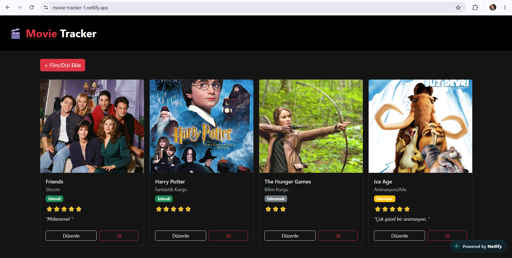

# 🎬 Movie Tracker

Film ve dizi izleme listesi uygulaması. React + Bootstrap 5 ile geliştirildi, ekleme/listeleme/güncelleme/silme (CRUD) işlemlerini tarayıcının `localStorage`'ı üzerinde gerçekleştirir.

🔗 **Canlı demo:** [movie-tracker-1.netlify.app](https://movie-tracker-1.netlify.app)



## Özellikler

- ➕ Film/dizi ekleme (başlık, tür, durum, puan, poster, yorum)
- 📋 Listeleme (kart görünümü)
- ✏️ Güncelleme
- 🗑️ Silme
- 💾 `localStorage` ile kalıcı veri saklama
- 🎨 Bootstrap 5 ile koyu tema

## Kullanılan Teknolojiler

- [React](https://react.dev/)
- [Vite](https://vite.dev/)
- [Bootstrap 5](https://getbootstrap.com/)

## Yerelde Çalıştırma

```bash
npm install
npm run dev
```

## Proje Yapısı

```
src/
  components/   → MovieForm, MovieList, MovieCard
  pages/        → Home
```
